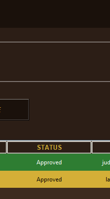
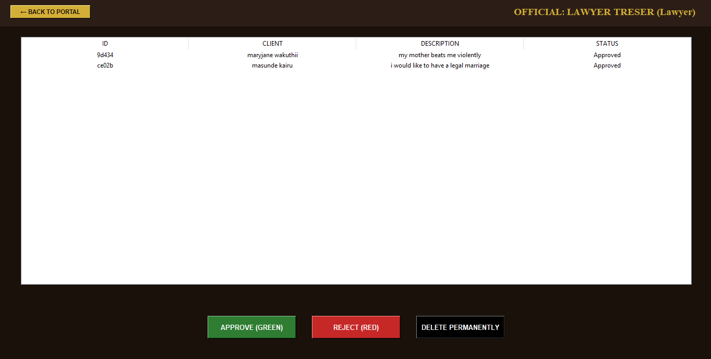

 Legal Management firm
 this project consist of a client dashboard where a client can add or file a new case,whether about family .criminal or any other case after that a reviewer will review the case and approve ,reject or delete the case out of the system.the create,read.update,delete process  is well presented.choice of colour was an old money type of brown blend ...


1. Entry & Authentication
Identity Lock: No user can file, edit, or delete a case without passing through the Secure Auth Gate.

2. The Case Lifecycle
Submission: Cases are initialized with a Pending status.


They have two primary powers: Approve (turns the record green) or Reject (turns the record red).

Audit Trail: Every review action records the specific staff member's name and role in the database.

3. The "Safety-First" Deletion Logic
To prevent accidental data loss of active litigation:

The Delete Button is programmatically hidden in the admin / reviewer Dashboard.

The Trigger: The button only reveals itself when a case with a Rejected status is selected.


 Interface Preview
The Client Portal
Where refined aesthetic meets functional case filing.


the admin portal
Observe the conditional logic: 'Permanent Delete' only appears for rejected cases.


Technical Stack
Frontend: Python Tkinter (Themed with Mahogany #2C1E16 and Gold #D4AF37).

Backend: Python 3.10+.

Database: MongoDB Atlas (Cloud-hosted persistent storage).


 File Architecture
main.py: The entry point and Client Portal.

login.py: The multi-role secure gate.

admin_dashboard.py: The internal staff review panel with conditional logic.

mongo.py: The database driver and CRUD logic.


Getting Started
Install Requirements:

Bash
pip install pymongo certifi
Connect Database: Update the uri in mongo.py with your Atlas connection string.

Launch: ```bash
python main.py


"Justice is the constant and perpetual will to allot to every man his due."
Developed by maryjane wakuthii | 2026